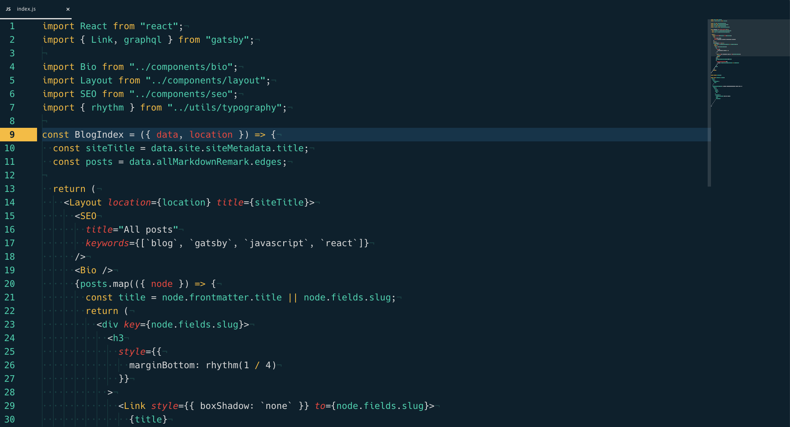

# Metropolis theme

A dark theme based off the [Metropolis keycap set](https://geekhack.org/index.php?topic=98355.0).

# Installation

On your console:

```
apm install metropolis-syntax
```

or install via Atom's settings install tab.

Works great when paired with a dynamic UI theme like [Kecleon UI](https://github.com/arturoalviar/atom-kecleon-ui).

```
apm install kecleon-ui
```

# Screenshots


